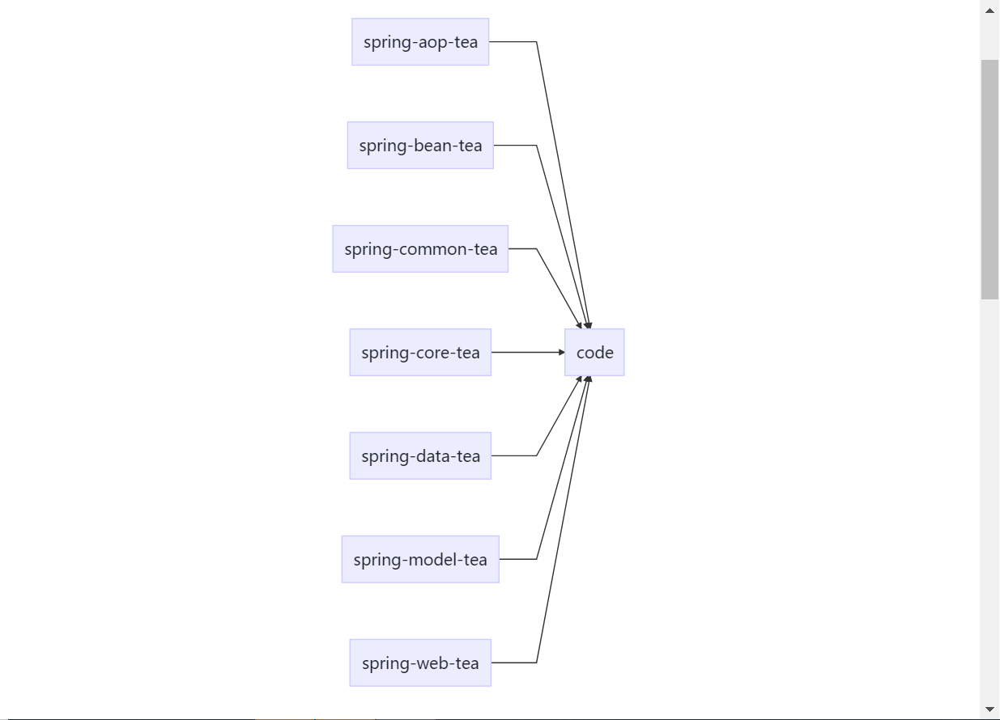

### 1. 项目maven结构


- **所有的maven依赖先在父工程```code```下进行jar包引入**.
- **model、common、aop、data**模块可以进行复用，但是```core```、```web```模块不可以被别的模块引用.

### 2. 各模块职能划分
#### 1. spring-aop-tea
研究注解切面逻辑，可以使用aspectJ、spring-aop、asm、JDK的```Annotation```关于面向切面的内容在这里进行实验。

#### 2. spring-bean-tea
研究spring-bean的相关代码.其中包括但不止于:Java对象的生命周期、spring Bean的生命周期，容器上下文后置处理器及aware接口等.

#### 3. spring-common-tea
研究工具类的模块.如:JSON解析，http请求工具类、XML格式解析、StringUtils、CollectionUtils、SpringContextUtils、DateUtils、FileUtils、LocalDateUtils、ThreadPoolUtils....

#### 4. spring-core-tea
用于实践功能的模块。例如设计模式、算法、关于Java的api使用、ORM、使用httpUtil等工具请求网络,引用spring-data进行中间件访问等等。

#### 5. spring-data-tea
利用spring生态整合中间件,如熟知的:Redis、RabbitMQ、ElasticSearch、Hadoop、HBase、MySQL、flink、ZooKeeper、RocketMQ、Kafka...

#### 6. spring-model-tea
对象仓库。关于可移植的对象，请定义在此模块。常见于业务系统的DO、BO、DTO、VO等.

#### 7. spring-web-tea
MVC入口,用于Rest API的访问

### 版本号管理
- 每个模块应该是支持独立打包的.
- 所有子模块的version应使用``` <version>${project.version}</version>```

### 常见问题
暂无
----
### 1. Git主干分支介绍
#### 1.1 master分支
master分支用于发布最新的代码，这些代码可供广大开发者进行拉取实践，所以切记不可随便合并。可以理解成生产分支。
#### 1.2 dev分支
dev分支用于做版本迭代，每个开发者在需求分支进行开发完毕后，合并到dev分支，避免相互提交发生冲突。
#### 1.3 feature分支
需求分支，每个开发者根据自己的开发需求，从master检出feature分支进行开发，自测通过后，可以合并到dev,并向master管理者发起合并分支请求.
#### 1.4 fixbug分支
从master分支检出fixbug分支用于修复代码BUG，修复完后，提交到dev，随着其他feature一起合并master.

### 2. 注意事项
#### 2.1 每切换到一个新的分支，最好都进行pull的操作合并一下最新的代码，然后再进行检出或者合并分支的操作。
#### 2.2 上传的代码最好经过阿里巴巴代码审查插件的扫描，可以在commit的时候设置钩子.
#### 2.3 禁止feature分支相互合并。  

